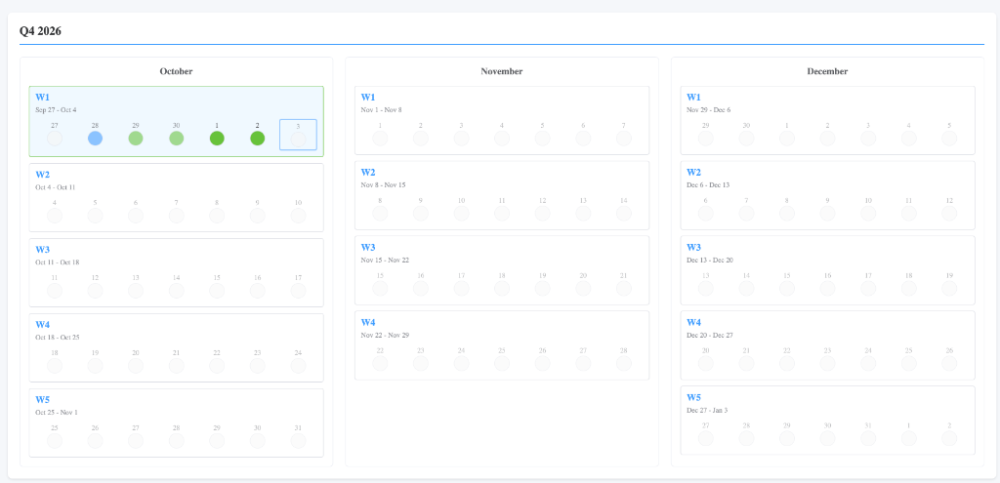

# Attendance Tracker

A modern web-based attendance tracking application built with Vue 3 and Element Plus. Track your daily attendance with an intuitive quarterly view, mark status for each day, and export data to Excel.



## Features

- **Quarterly View**: Visualize attendance across all four quarters of the year
- **Daily Tracking**: Mark attendance status for each individual day
- **Multiple Status Types**: Track In-office, WFH, PTO, Sick Leave, Other Leave, and Flexible Time Off
- **Compliance Tracking**: Monitor quarterly compliance with average in-office days per week
- **Card-Based Compliance Display**: Visual cards for each quarter with status indicators
- **Date Restrictions**: Future dates and weekends are disabled for attendance entry
- **Local Storage**: All data is saved locally in your browser
- **Excel Export**: Export attendance data to Excel spreadsheets
- **Excel Import**: Import existing Excel data to update the tracker
- **Year Selection**: Switch between different years
- **Visual Indicators**: 
  - Current week highlighting
  - Today's date marking
  - Color-coded status with hover tooltips
  - Weekend differentiation
  - Compliance status icons (checkmark, X, question mark)

## Tech Stack

- **Vue 3** - Progressive JavaScript framework
- **Element Plus** - Vue 3 UI component library
- **Vite** - Next generation frontend tooling
- **XLSX** - Excel file generation and parsing

## Installation

### Prerequisites

- Node.js (v16 or higher)
- npm or yarn

### Setup

1. Clone the repository:
```bash
git clone https://github.com/yourusername/attendance-tracker.git
cd attendance-tracker
```

2. Install dependencies:
```bash
npm install
```

3. Start the development server:
```bash
npm run dev
```

4. Open your browser and navigate to `http://localhost:3000`

## Usage

### Compliance Tracking

The application displays compliance status for each quarter (Q1-Q4) in a card layout:

- **Compliance Calculation**: Based on average in-office days per week (target: 3+ days)
- **Q1-Q3**: Shows compliance for all weeks with attendance entries
- **Q4**: Shows compliance for completed weeks and the current week
- **Status Indicators**:
  - ✅ Green card with checkmark: Compliant (average ≥ 3 in-office days/week)
  - ❌ Red card with X: Not Compliant (average < 3 in-office days/week)
  - ❓ Gray card with question mark: Not Available (no attendance entries)
- Only In-office days count toward compliance calculation

### Marking Attendance

1. Click on any day (except weekends) to open the status selector
2. Select your attendance status from the dropdown
3. The status is automatically saved to local storage

### Exporting to Excel

1. Click the "Export to Excel" button in the header
2. An Excel file named `attendance_YYYY.xlsx` will be downloaded
3. The file contains columns: Date, Day, and Status

### Importing from Excel

1. Click the "Import from Excel" button in the header
2. Select an existing Excel file
3. The attendance data will be merged with your current data

### Switching Years

Use the year dropdown in the header to switch between different years. Each year's data is stored separately in local storage.

## Status Types

| Status | Color | Description |
|--------|-------|-------------|
| In-office | Green | Working from office |
| WFH | Blue | Working from home |
| PTO | Orange | Paid time off |
| Sick Leave | Red | Sick leave |
| Other Leave | Gray | Other types of leave |
| Flexible Time Off | Purple | Flexible time off |

## Project Structure

```
attendance-tracker/
├── public/
├── src/
│   ├── components/
│   ├── App.vue
│   └── main.js
├── docs/
│   ├── screenshots/
│   └── USER_GUIDE.md
├── index.html
├── package.json
├── vite.config.js
└── README.md
```

## Building for Production

```bash
npm run build
```

The built files will be in the `dist/` directory.

## Data Storage

All attendance data is stored in your browser's local storage under the key `attendance_YYYY` (where YYYY is the year). Data is persisted between sessions and is specific to each year.

## Excel Format

The exported Excel file follows this format:

| Date | Day | Status |
|------|-----|--------|
| 2024-10-01 | Tuesday | In-office |
| 2024-10-02 | Wednesday | WFH |

When importing, the application matches dates and updates the corresponding status.

## Browser Compatibility

- Chrome/Edge (recommended)
- Firefox
- Safari
- Any modern browser with local storage support

## Contributing

Contributions are welcome! Please feel free to submit a Pull Request.

## License

This project is licensed under the MIT License - see the [LICENSE](LICENSE) file for details.

## Acknowledgments

- Built with [Vue.js](https://vuejs.org/)
- UI components from [Element Plus](https://element-plus.org/)
- Excel handling by [SheetJS](https://sheetjs.com/)
