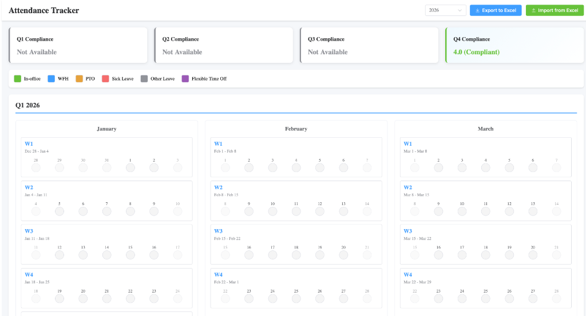

# Attendance Tracker - User Guide

## Table of Contents

1. [Getting Started](#getting-started)
2. [Interface Overview](#interface-overview)
3. [Compliance Tracking](#compliance-tracking)
4. [Marking Attendance](#marking-attendance)
5. [Viewing Attendance](#viewing-attendance)
6. [Exporting Data](#exporting-data)
7. [Importing Data](#importing-data)
8. [Managing Multiple Years](#managing-multiple-years)
9. [Understanding the Quarterly View](#understanding-the-quarterly-view)
10. [Data Storage and Backup](#data-storage-and-backup)
11. [Troubleshooting](#troubleshooting)

## Getting Started

### First Time Setup

1. Ensure you have Node.js installed (version 16 or higher)
2. Navigate to the attendance-tracker directory
3. Install dependencies:
   ```bash
   npm install
   ```
4. Start the application:
   ```bash
   npm run dev
   ```
5. Open your browser to `http://localhost:3000`


## Interface Overview

### Header Section

The header contains:
- **Application Title**: "Attendance Tracker"
- **Year Selector**: Dropdown to choose the year (previous, current, next year)
- **Export Button**: Download attendance data as Excel
- **Import Button**: Load attendance data from Excel file


### Status Legend

Below the header, you'll see a color-coded legend showing all available status types:
- 🟢 In-office (Green)
- 🔵 WFH (Blue)
- 🟠 PTO (Orange)
- 🔴 Sick Leave (Red)
- ⚫ Other Leave (Gray)
- 🟣 Flexible Time Off (Purple)


### Quarterly View

The main area displays four quarters (Q1-Q4), each containing three months:
- **Q1**: January, February, March
- **Q2**: April, May, June
- **Q3**: July, August, September
- **Q4**: October, November, December

Each month shows weeks with individual days.


## Compliance Tracking

### Understanding Compliance Cards

The application displays four compliance cards at the top of the main content area, one for each quarter (Q1-Q4).



### Compliance Calculation

Compliance is calculated based on the average number of in-office days per week:

- **Target**: 3 or more in-office days per week
- **Only In-office days count**: WFH, PTO, Sick Leave, and other statuses do not count toward compliance
- **Week-based calculation**: Average is calculated across all weeks with attendance entries

### Quarter-Specific Behavior

The compliance calculation behaves differently based on the year and quarter:

- **Current Year, Current Quarter**: Compliance includes:
  - Completed Monday-Friday work weeks only
  - The current work week only after it ends
  - Excludes the current in-progress week and future weeks

- **Current Year, Past Quarters**: Compliance is calculated for all weeks that have attendance entries

- **Past Years**: Compliance is calculated for all weeks that have attendance entries

- **Future Years**: Compliance is calculated for all weeks that have attendance entries (once data is entered)

**Example**: If today is Monday, October 5, 2026 (Q4):
- Q1, Q2, Q3 (2026): Show compliance for all weeks with entries
- Q4 (2026): Excludes the October 5-9 work week until it has ended
- Q1-Q4 (2027): Show compliance for all weeks with entries (once entered)
- Q1-Q4 (2025): Show compliance for all weeks with entries

### Compliance Status Indicators

Each compliance card shows:

- **Green Card with ✅ Checkmark**: Compliant
  - Average in-office days ≥ 3 per week
  - Left border: Green
  - Background: Subtle green gradient

- **Red Card with ❌ X**: Not Compliant
  - Average in-office days < 3 per week
  - Left border: Red
  - Background: Subtle red gradient

- **Gray Card with ❓ Question Mark**: Not Available
  - No attendance entries for the quarter
  - Left border: Gray
  - Text: "Not Available"

### Example Calculations

**Example 1: Compliant**
- Week 1: 4 in-office days
- Week 2: 3 in-office days
- Average: (4 + 3) / 2 = 3.5
- Status: Compliant ✅

**Example 2: Not Compliant**
- Week 1: 2 in-office days, 2 WFH, 1 PTO
- Week 2: 2 in-office days, 3 WFH
- Average: (2 + 2) / 2 = 2.0
- Status: Not Compliant ❌

**Example 3: Becoming Compliant**
- Week 1: 2 in-office days (already completed)
- Week 2: 5 in-office days (current week, not yet complete)
- Average: (2 + 5) / 2 = 3.5
- Status: Compliant ✅

### Improving Compliance

To improve your compliance:

1. **Increase In-office Days**: Mark more days as "In-office" rather than WFH
2. **Track Weekly Progress**: Monitor the compliance card to see your current average
3. **Plan Ahead**: Schedule more in-office days for upcoming weeks
4. **Review Past Weeks**: If possible, update past weeks with accurate in-office days

### Compliance Card Features

- **Hover Effect**: Cards lift slightly when hovered for better interactivity
- **Responsive Layout**: Cards stack vertically on smaller screens
- **Real-time Updates**: Compliance recalculates automatically when you update attendance
- **Color Coding**: Quick visual recognition of compliance status

## Marking Attendance

### Step-by-Step Process

1. **Select a Day**: Click on any day cell (except weekends and future dates)
   - Weekends (Saturday/Sunday) are grayed out and cannot be selected
   - Future dates are dimmed and cannot be selected
   - Days from adjacent months (shown in the same week) are slightly dimmed but selectable
   - Today and past dates are selectable

2. **Choose Status**: A dialog will appear with a status dropdown
   - Select your attendance status from the list
   - Click "Save" to confirm or "Cancel" to discard

3. **Automatic Save**: The status is immediately saved to local storage
   - The day's status indicator will change color
   - Hover over the colored circle to see the status label


### Status Selection Tips

- **In-office**: Use when working from the office
- **WFH**: Use when working from home
- **PTO**: Use for planned paid time off
- **Sick Leave**: Use when taking sick leave
- **Other Leave**: Use for other types of leave (bereavement, jury duty, etc.)
- **Flexible Time Off**: Use for flexible time off hours

## Viewing Attendance

### Visual Indicators

- **Colored Circles**: Each day with a status shows a colored circle
- **Hover Tooltips**: Hover over colored circles to see the status label
- **Current Week**: The current week is highlighted with a green border
- **Today**: Today's date has a blue border
- **Weekends**: Weekends are grayed out and not selectable


### Checking Attendance History

1. Use the year dropdown to switch between years
2. Scroll through the quarters to view different months
3. Hover over any colored status circle to see the details

## Exporting Data

### Export to Excel

1. Click the "Export to Excel" button in the header
2. An Excel file named `attendance_YYYY.xlsx` will be downloaded
3. The file contains three columns:
   - **Date**: The date in YYYY-MM-DD format
   - **Day**: The day of the week (Monday, Tuesday, etc.)
   - **Status**: The attendance status label


### Excel File Format

Example exported data:

| Date | Day | Status |
|------|-----|--------|
| 2026-10-01 | Thursday | In-office |
| 2026-10-02 | Friday | WFH |
| 2026-10-05 | Monday | In-office |

### Updating Existing Excel Files

When you export multiple times, you'll get new files. To maintain a single updated file:
1. Export your current data
2. Open the new Excel file
3. Copy the data and paste it into your master Excel file
4. Or use the Import feature to merge data

## Importing Data

### Import from Excel

1. Click the "Import from Excel" button in the header
2. Select an Excel file in `.xlsx` format
3. The application will read the file and update attendance data
4. Data is merged with existing entries (dates are matched)


### Excel File Requirements

The Excel file must have the following structure:
- First row: Headers (Date, Day, Status)
- Subsequent rows: Attendance data
- Date format: YYYY-MM-DD
- Status: Must match one of the status labels exactly

### Import Behavior

- **Matching by Date**: The import matches dates and updates the status
- **No Overwrite Warning**: Existing data will be updated without warning
- **New Dates**: Dates not currently in the tracker will be added
- **Status Validation**: Invalid status labels will be imported as-is

## Managing Multiple Years

### Switching Years

1. Use the year dropdown in the header
2. Select the desired year (previous, current, or next)
3. The view updates to show that year's quarters
4. Each year's data is stored separately

### Year-Specific Data

- Data is stored under keys like `attendance_2024`, `attendance_2025`
- Switching years doesn't affect other years' data
- Export/Import operations work on the currently selected year

## Understanding the Quarterly View

### Week Organization

Weeks are organized based on the **Thursday rule**:
- A week belongs to the month that contains its Thursday
- This ensures consistent week numbering across months
- Example: Sept 28-30 (Sun-Tue) + Oct 1-5 (Wed-Sun) = October Week 1 (Thursday Oct 2 is in October)

### Quarter Boundaries

- **Q1**: January 1 - March 31
- **Q2**: April 1 - June 30
- **Q3**: July 1 - September 30
- **Q4**: October 1 - December 31

### Week Display

- Each week shows 7 days (Sunday through Saturday)
- Days from adjacent months are shown in the same week
- Only weeks with Thursday in the current month are displayed
- This prevents the last week of December (with Thursday in January) from appearing in Q4

## Data Storage and Backup

### Local Storage

- The web version stores data in your browser's local storage
- The macOS app stores data in `attendance.json` inside its application data directory
- Data persists between browser or application sessions
- Data remains local to the browser or Mac unless you explicitly export it
- To migrate from the web version, export an Excel workbook and import it in the macOS app

### Backup Recommendations

1. **Regular Exports**: Export your data regularly to Excel
2. **Multiple Copies**: Keep backup copies of your Excel files
3. **Cloud Storage**: Store Excel files in cloud storage (Google Drive, Dropbox, etc.)
4. **Device Migration**: To move to another device, export and import your Excel file

### Clearing Data

To clear all attendance data for a year:
1. Open your browser's developer tools (F12)
2. Go to the Application tab
3. Navigate to Local Storage
4. Find the key `attendance_YYYY` (replace YYYY with the year)
5. Delete the key

## Troubleshooting

### Data Not Saving

**Problem**: Status changes are not persisting

**Solutions**:
- Check that your browser has local storage enabled
- Try incognito/private mode to test if extensions are interfering
- Clear browser cache and reload the page

### Import Not Working

**Problem**: Excel import fails or data doesn't appear

**Solutions**:
- Ensure the Excel file has the correct column headers (Date, Day, Status)
- Check that dates are in YYYY-MM-DD format
- Verify status labels match exactly (case-sensitive)
- Try exporting first to see the correct format

### Week Display Issues

**Problem**: Weeks don't display correctly or dates are wrong

**Solutions**:
- Refresh the page to reload the application
- Check that your system date/time is correct
- Try a different browser to rule out browser-specific issues

### Export Not Downloading

**Problem**: Excel file doesn't download when clicking export

**Solutions**:
- Check browser download permissions
- Disable popup blockers
- Try right-clicking the export button and selecting "Open in new tab"

### Performance Issues

**Problem**: Application is slow or unresponsive

**Solutions**:
- Close other browser tabs
- Clear browser cache
- Use a modern browser (Chrome, Firefox, Edge)
- Check if you have a large amount of data (consider archiving old years)

## Support

For issues, questions, or feature requests, please visit the [GitHub repository](https://github.com/Vinodsathyaseelan/attendance-tracker) and open an issue.
